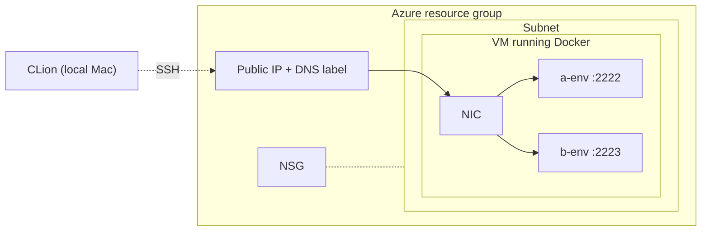

# Architecture

## Mental model
One Azure VM runs Docker, with a separate container for each OMSCS
course. CLion connects over SSH to the container's exposed port.

## Rationale

**Why an Azure VM rather than Codespaces or a serverless option?**
I already had Azure credits, so using Azure was a no brainer. Plus, 
choosing a VM over something ephemeral means state persists between 
sessions, costs stay predictable, and there's no per-CPU-minute billing 
during a long debugging session.

**Why one VM with containers instead of one VM per course?**
A single VM shares its idle cost across courses, runs on one
auto-shutdown schedule, and only needs one set of credentials to
manage. Containers keep each course's toolchain isolated, so they
don't conflict.

**Why x64 specifically?**
GIOS ships an x64 Docker image, and emulating it on an M-series Mac
was the original problem this setup solves. Running on a real x64 host
avoids the emulation entirely.

## Deploy lifecycle
When you run `./deploy.sh`:

1. Source `.env` for overrides, then apply the built-in defaults.
2. Read `containers/docker-compose.yml` with `yq` to get the active
   set of `:22` host ports, filtered by `COMPOSE_PROFILES`.
3. Run `az deployment group create` against `main.bicep`. Bicep
   provisions or updates the resource group, VNet, subnet, NIC, NSG
   (using the ports from step 2), public IP with the chosen DNS
   label, the VM itself, the auto-shutdown schedule, and a custom
   script extension that installs Docker on first boot.
4. `rsync` copies `containers/` to the VM under `~/containers/`.
5. `ssh` into the VM and run `docker compose up -d --build --remove-orphans`
   with the active profiles. New containers come up, and any
   containers tied to dropped profiles get stopped and removed.

## NSG and Compose profiles
`COMPOSE_PROFILES` drives two things at once: which services Compose
starts on the VM, and which `:22` ports `deploy.sh` opens in the NSG.
Disabling a course on a redeploy removes both its container and its
inbound rule, so what's running and what's reachable stay in sync.

## SSH access for containers
On first boot, the custom script extension creates
`/var/lib/dev-vm/authorized_keys` as a symlink to the admin user's
`~/.ssh/authorized_keys`. Each container then bind-mounts that fixed
path to its own `/etc/ssh/authorized_keys`. Containers authenticate
against the same key as the VM, without hardcoding the admin username
into the compose file.

## Auto-shutdown
Bicep attaches a `Microsoft.DevTestLab/schedules` resource to the VM,
which deallocates it at the configured time each day. Idle compute cost
drops to zero while storage keeps accruing.
