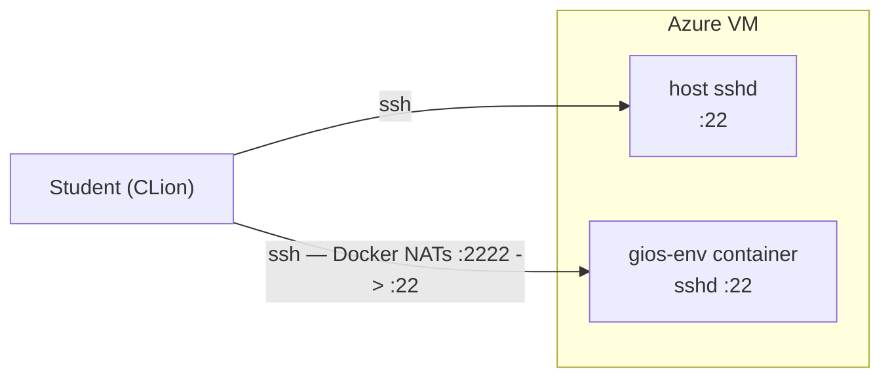

# OMSCS Dev VM on Azure — walkthrough

By the end of this guide you'll have an Azure VM running a Docker container
per OMSCS course, ready as a remote build target for any IDE that speaks
SSH. About 10 minutes, mostly waiting on Azure. For CLion remote builds
specifically, see [CLION.md](CLION.md).

## Overview



Resource group `rg-omscs-eastus2`, region `eastus2`, VM size `Standard_B2s`. The host
runs Ubuntu 24.04 LTS; the container is built from
`gtomscs6200/spr26-environment`.

The VM listens on two ports. **22** goes to the host's own sshd, where the
admin user logs in for shell access. **2222** is mapped by Docker straight
to the `gios-env` container's sshd on port 22, so connecting to `:2222`
lands you inside the container as `root`. The host sshd is not involved in
that second path — Docker handles the forwarding at the kernel level.

The container's sshd reads its `authorized_keys` from a path that's
bind-mounted from the host (`/var/lib/dev-vm/authorized_keys`, which the
CSE bootstrap symlinks to the `omscs` admin user's `~/.ssh/authorized_keys`).
So the same SSH key gets you into the host *and* the container — no
separate key management.

When you add a second container later (e.g. `aos-env` for Advanced Operating
Systems), it'll get its own port mapping (2223 -> its container's 22), and
you'll connect with `ssh -p 2223 root@<vm-ip>`.

## Before you start

You need:

- An Azure subscription with permission to create resource groups and VMs.
- Homebrew (https://brew.sh).
- `az` CLI (`brew install azure-cli`).
- `yq` (`brew install yq`).
- An SSH keypair at `~/.ssh/id_ed25519` (run `ssh-keygen -t ed25519` if needed).

That's it. Everything else (resource group, VM, container) gets created by
the script.

## Step 1 — Log in to Azure

```bash
az login
```

A browser window opens. Sign in. When you come back you should see your
subscription printed:

```
[
  {
    "name": "Your Subscription Name",
    "id": "...",
    ...
  }
]
```

If you have multiple subscriptions, pick one:

```bash
az account set --subscription "Your Subscription Name"
```

## Step 2 — Clone and enter the repo

```bash
git clone git@github.com:kylemart/gt-omscs-infra.git
cd gt-omscs-infra
```

Quick sanity check that you're in the right place:

```bash
ls
# bootstrap.sh  CLION.md  containers  deploy.sh  main.bicep  README.md
```

## Step 3 — Run the deploy script

```bash
./deploy.sh
```

The defaults deploy a fresh VM under resource group `rg-omscs-eastus2` in
`eastus2` with VM name `omscs-dev-vm-eastus2`. To use different values see
[Reference > Overrides](#overrides) below.

You'll see, in order:

1. `Subscription:` line confirming what you're deploying into.
2. `==> Provisioning VM in rg-omscs-eastus2...` and a table of resources being
   created. The deploy pauses for ~2-3 minutes while the Custom Script
   Extension installs Docker on the VM (first deploy only).
3. `==> Syncing containers/ to <fqdn>...` — `rsync` ships the container
   files (only changed bytes on subsequent deploys).
4. `==> Bringing services up...` — `docker compose up -d --build` over
   SSH. First run does the full image build (~1-2 minutes); later runs
   only rebuild changed services.
5. `==> Done. Connect: ssh ...` with the FQDN to use.

When the script returns, **everything is ready**. The container is up and
listening on port 2222.

> If the deploy fails inside the CSE phase, you can read the bootstrap
> script's stdout/stderr from the VM after SSHing in:
>
> ```bash
> sudo cat /var/log/azure/Microsoft.Azure.Extensions.CustomScript/handler.log
> ```

## Step 4 — Verify the host and the container

Two checks. Both should print successfully.

Host (Docker is installed, the user is in the docker group, compose can
list services without sudo):

```bash
ssh omscs@<vm-ip> 'cd ~/containers && docker compose ps'
```

Expected: a row for the `gios-env` service, status `running`, port
`0.0.0.0:2222->22/tcp`.

Container (CLion's path in — logs in as `root` on port 2222 using the
same SSH key):

```bash
ssh -p 2222 root@<vm-ip> 'cmake --version && which protoc grpc_cpp_plugin'
```

Expected: a CMake version (>= 3.16) and paths for both `protoc` and
`grpc_cpp_plugin`.

If both work, the infra is good.

## Step 5 — Configure your IDE

For CLion, see [CLION.md](CLION.md). Other IDEs that support remote SSH
toolchains will work the same way: connect to `<vm-ip>:2222` as `root` and
let the IDE sync source to the container and drive `/usr/bin/{cmake,make,gcc,g++,gdb}`.

---

## Reference

### Files

| Path | Purpose |
|---|---|
| `main.bicep` | VM, vnet, NSG, public IP, NIC, auto-shutdown, and the Custom Script Extension that runs `bootstrap.sh` on the VM. |
| `deploy.sh` | Three phases: provision via `az deployment group create`, `rsync` of `containers/` onto the VM, then `docker compose up` over SSH. |
| `bootstrap.sh` | Script the CSE runs on the VM. Installs Docker (first deploy) and sets up the fixed `/var/lib/dev-vm/authorized_keys` symlink for the bind-mount. |
| `containers/docker-compose.yml` | Lists every service that should run on the VM. One service per course. |
| `containers/gios-env/Dockerfile` | Build env on top of `gtomscs6200/spr26-environment`. Configures sshd to read keys from a fixed path (`/etc/ssh/authorized_keys`) so docker-compose can bind-mount the host's `authorized_keys` straight there. |
| `CLION.md` | CLion-specific setup for using the container as a remote build target. |

### Overrides

Defaults live in `deploy.sh`, and most Bicep params have a matching env
var. The exceptions are `containerSshPorts` (derived from `docker-compose.yml`)
and `adminUsername` (hardcoded to `omscs`, not configurable). Two ways to
override.

**Persistent (recommended for things you set every run):** copy
`.env.example` to `.env` and uncomment the values you want.

```bash
cp .env.example .env
$EDITOR .env       # uncomment SSH_SOURCE_ADDRESS_PREFIX, AUTO_SHUTDOWN_EMAIL, etc.
./deploy.sh
```

`.env` is gitignore-friendly (sensitive bits like your IP and email stay
local). `deploy.sh` sources `.env` before applying built-in defaults, so
anything uncommented there wins.

**One-off (per command):** prefix inline env vars. These only take effect
for keys NOT uncommented in `.env`.

```bash
RG=rg-omscs-test-eastus2 ./deploy.sh
```

| Env var | Default | Purpose |
|---|---|---|
| `RG` | `rg-omscs-$LOCATION` | Resource group name. |
| `LOCATION` | `eastus2` | Azure region for the RG and resources. |
| `VM_NAME` | `omscs-dev-vm-$LOCATION` | Used to derive NIC/NSG/IP/disk names. |
| `VM_SIZE` | `Standard_B2s` | VM SKU. |
| `SSH_KEY` | `~/.ssh/id_ed25519.pub` | Public key embedded in the VM's `authorized_keys`. |
| `SSH_SOURCE_ADDRESS_PREFIX` | `*` | NSG inbound source. Lock to your IP for security. |
| `AUTO_SHUTDOWN_ENABLED` | `true` | Enable the daily auto-shutdown schedule. |
| `AUTO_SHUTDOWN_TIME` | `1900` | Local time to shut down, `HHmm` 24-hour. |
| `AUTO_SHUTDOWN_TIME_ZONE` | `UTC` | Windows time-zone id. |
| `AUTO_SHUTDOWN_EMAIL` | empty | Email for the 30-min advance notice. Empty = no email. |

### Iterating on a container

Edit the file in `containers/<service>/` locally, then re-run `./deploy.sh`.
`rsync` ships only the changed files and `docker compose up -d --build`
rebuilds only the affected service.

If you want to iterate without redeploying (e.g. you're SSH'd to the VM
already), you can also rebuild on the VM directly:

```bash
ssh omscs@<vm-ip>
cd ~/containers
docker compose up -d --build <service-name>     # rebuild + restart one
docker compose up -d --build                    # rebuild + restart everything that changed
```

Changes made directly on the VM are **lost the next time you redeploy**
because `rsync --delete` mirrors the local `containers/` onto the VM. Use
the redeploy path for anything you want to keep.

### Adding a new container

For a new course (e.g. `aos-env` for Advanced Operating Systems on port
2223):

1. Create a `containers/<service>/` directory with a `Dockerfile` for the
   course's environment. The existing `gios-env/Dockerfile` is a
   reasonable starting point to copy and adapt.
2. Add a matching service block to `containers/docker-compose.yml`,
   choosing an unused host port for its `:22` mapping.
3. Run `./deploy.sh`. The new port opens in the NSG, the container is
   built and started on the VM, and existing containers keep running.

### Removing a container

1. Delete `containers/<service>/`.
2. Remove the service block from `containers/docker-compose.yml`.
3. Run `./deploy.sh`. The directory disappears from the VM, the NSG rule
   for the unused port goes away, and the container is stopped and removed.

The image stays cached on the VM. Use `docker image prune` to reclaim disk.

### How rebuilds happen

`deploy.sh` always runs three phases, but each one short-circuits when
nothing has changed.

**Provision.** ARM diffs the Bicep template against the current state of
the resource group. First deploys create everything; subsequent deploys
touch nothing unless `main.bicep` or `bootstrap.sh` changed.

**Sync.** `rsync` mirrors `containers/` onto the VM, sending only changed
bytes.

**Compose up.** Compose rebuilds only the services whose source changed,
leaves untouched services running, and removes any service that no longer
exists in `docker-compose.yml`.

### Tear down

```bash
az group delete --name rg-omscs-eastus2 --yes --no-wait
```

Wipes the whole resource group. If the RG has other resources you want
to keep, delete the VM, NIC, public IP, NSG, vnet, and disk by name
instead.

### Why the Dockerfile strips `ForceCommand`

The base image's sshd had `ForceCommand=/usr/local/sbin/ssh_wrapper.sh`,
which prints the Gradescope MOTD before any command runs. CLion parses
stdout from CMake probes (e.g. `mkdir /tmp/cmake_check_*`) and chokes on
the MOTD bytes, breaking remote builds. The Dockerfile sed's it out.
